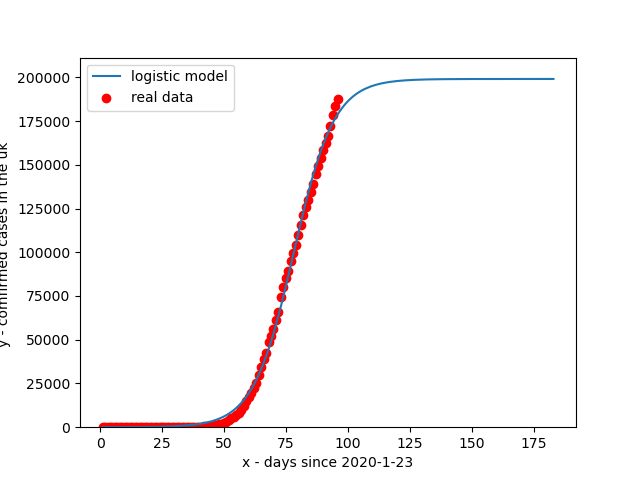
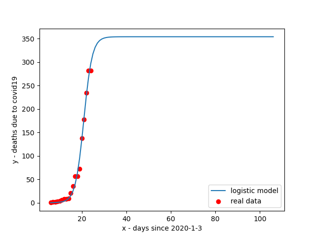
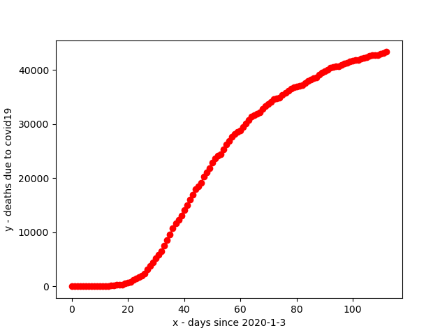

## Welcome to some COVID-19 data

**DISCLAIMER** this may not be accurate data and no real predictions should be made of this graph. The Data and curve on this graph are liable to change

#### Graphs

##### Cases

Overall predicton: **may not be accurate**

Zoomed in graph

Here is just the pure data, no forcasting trendline, just lines between points

##### Deaths

Overall prediction: **may not be accurate**

Pure data, lines connectiong data points

#### Important links
[U.K government advice](https://www.nhs.uk/conditions/coronavirus-covid-19/)

[data sourced from: cases](https://www.arcgis.com/home/item.html?id=e5fd11150d274bebaaf8fe2a7a2bda11)

[data sourced from: deaths](https://github.com/CSSEGISandData/COVID-19)
