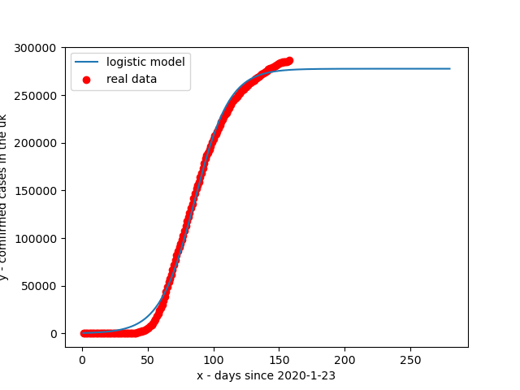
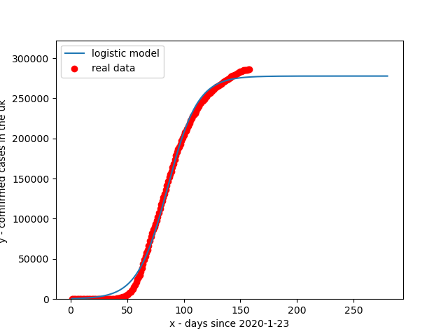
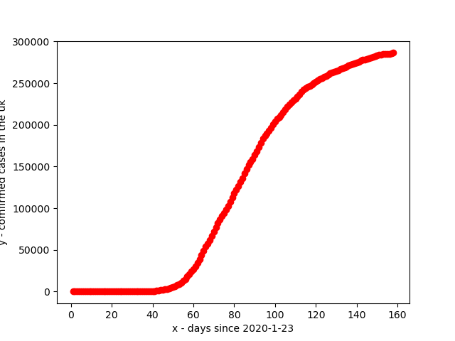

## Welcome to some COVID-19 data

### **DISCLAIMER** this may not be accurate data and no real predictions should be made of this graph. The Data and curve on this graph are liable to change

#### Graphs

Overall predicton: **may not be accurate**

Zoomed in graph

Here is just the pure data, no forcasting trendline, just lines between points

#### Important links
[U.K government advice](https://www.nhs.uk/conditions/coronavirus-covid-19/)

[data sourced from](https://www.arcgis.com/home/item.html?id=e5fd11150d274bebaaf8fe2a7a2bda11)
